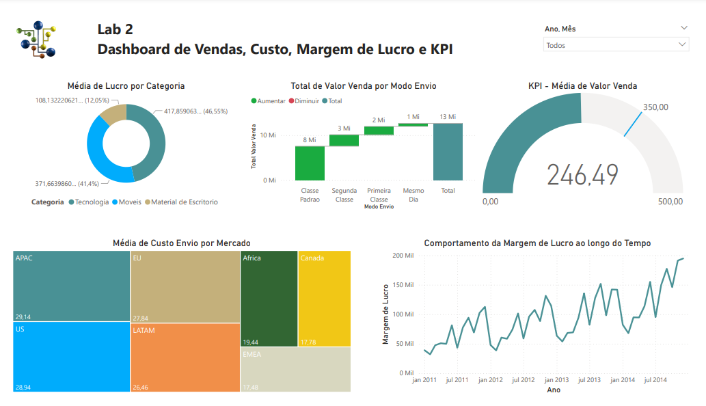

# Microsoft Power BI for Business Intelligence and Data Science
Lab 2
Sales, Cost, Profit Margin and KPI Dashboard

1- What was the total sales value considering each order shipping method? 
2- Which markets had the highest average shipping cost for products sold? 
3- The company aims (goal) to maintain an average of 350 for the sales value every month. Show an indicator (KPI – Key Performance Indicator) with the average sales value. Was the company below or above the target in April/2014? 
4- Consider that the profit is equivalent to: sales value - shipping cost. Which product category showed the highest average profit? 
5- What was the behavior of the profit margin over time? Consider the profit margin as the profit divided by the sales value. 

